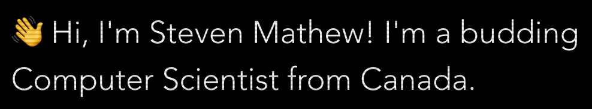

  

    

  

Hi there, I'm <a href="http://steven-mathew.github.io/">Steven</a> and welcome to my GitHub. I'm a second-year student based in Toronto 🇨🇦 &#160;attending UofT interested in open-source develpment. 👋 

  
<b>2021 Goal 🌱</b>

  Try out <a href="https://www.rust-lang.org/">rust</a> and write a programming-language based in it. 

<!--
**steven-mathew/steven-mathew** is a ✨ _special_ ✨ repository because its `README.md` (this file) appears on your GitHub profile.

Here are some ideas to get you started:

- 🔭 I’m currently working on ...
- 🌱 I’m currently learning ...
- 👯 I’m looking to collaborate on ...
- 🤔 I’m looking for help with ...
- 💬 Ask me about ...
- 📫 How to reach me: ...
- 😄 Pronouns: ...
- ⚡ Fun fact: ...
-->
